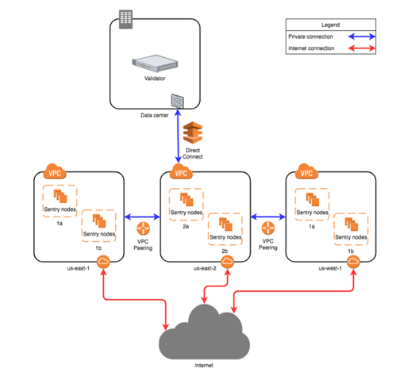

# Taycan mainnet security audit & React
Taycan mainnet은 audit 전문업체 slomist를 통해 보안성을 검토 받았고 아래 audit report와 같이 Low Risk의 결과를 받았습니다.  
[Slomist Blockchain security audit report – taycan mainnet](./SlowMist%20Audit%20Report%20-%20Taycan.pdf)

Slomist의 audit 결과 지적된 low risk 내역에 대해 아래와 같이 안내 합니다.

## "False top up" risks / [Off-Chain]False Topup Audit / Low 
네이티브 토큰 충전을 위한 계약을 사용할 경우 악의적인 계약 되돌리기로 인해 전송 프로세스가 중단될 수 있지만 트랜잭션 상태가 성공적이어서 유효한 이벤트 판단이 수행되지 않으면 가짜 충전이 발생할 수 있습니다.  
실패한 거래도 블록으로 묶이고 거래의 상태를 확인하지 않으면 거래소에 "거짓 충전" 문제가 발생합니다.  
스마트 컨트랙트 작성시 발생할 수 있는 취약점으로 이 문제를 방지하기 위해서 체인단계가 아닌 토큰이나 컨트랙트 발행시 유의하길 권장하며 거래 성공여부 판단 외 재충전 지갑 주소의 잔액이 정확히 증가했는지 여부를 판단 하기 바랍니다. 또한 타이칸 메인넷을 통해 제작된 토큰이나 컨트랙트는 오딧을 통해 보안성을 검토 받을 것을 권장합니다.

## RPC "Black Valentine's Day" vulnerability / [RPC]The Ethereum Black Valentine's Day Vulnerability / Low 
타이칸은 RPC 통신으로 작동할 수 있는 EVM 호환 블록체인으로 RPC에는 지갑 기능이 있으며, 포트가 로컬이 아닌 액세스를 위해 열려 있는 경우 공격자는 RPC 포트를 통해 자금을 훔칠 수 있습니다.  

타이칸은 위의 그림과 같이 설계하여 RPC가 접속하는 센트리 노드에 지갑을 없애 RPC 포트를 통한 금탈취 취약점에 대해 조치합니다.

## Transaction malleability risk / [Encryption]Transaction Malleability Attack / Suggestion
비트코인이나 이더리움 등 대부분의 암호화폐는 secp256k1 표준을 이용한 타원곡선암호기술을 이용해 공개키 암호 시스템을 사용하고 이를 ECDSA(Elliptic Curve Digital Signature Algorithm)이라 한합니다. 
Secp256k1 알고리즘에서 트랜잭션을 서명할 때 트랜잭션의 서명을 구하기 위해 서명 s,r값을 이용합니다. 기준점이 되는 값에 랜덤한 숫자를 곱해 서명 r이라 하고 랜덤한 수의 제곱에서 트랜잭션 정보를 직렬 정렬한 값과 r값과 개인키를 곱한값을 빼고 n으로 나눈 값을 서명 s라 합니다. s와 r은 코인을 전송할 때 서명이 생성되고 수신자가 서명을 받고 검증하는 절차에 사용됩니다. 이 때 s의 값이 너무 높은 값이 대입되면 외부의 조건에 따라 상대가 변경되는 가단성의 위험이 있습니다.  
타이칸에서 트랜잭션을 발생할 때 s 서명의 높은 값을 사용하지 않기를 권장합니다.

## Not return error when replay a transaction / [Ledger]Transaction Replay Attack / Low
트랜잭션의 비동기처리 과정에서 블록체인에서 성능을 위해 트랜잭션의 성공여부를 즉시 반환하는 게 아니라 트랜잭션의 해쉬를 반환하게 되는데 이때 해쉬를 받았다고 해서 트랜잭션이 성공했다는 것이 아니라 체인을 사용하는 사용자는 해당 해쉬의 결과를 항상 검증하도록 되어 있습니다.  
  그리하여 오류 메세지가 반환되지 않는 점으로 트랜잭션재생 공격이 가능하다고 생각할 수 있지만 트랜잭션을 보낼 때 지갑에 트랜잭션 발생횟수인 nonce값을 확인해야 하기 때문에 똑같은 트랜잭션은 원천적으로 차단되고 있고 저희가 만든 지갑은 물론 메타마스크 지갑에서도 해당 트랜잭션이 완료되었는지 검증하는 옵션을 통해(ethereum의 경우 5confirm을 확인합니다.) 해당 이슈는 문제되지 않습니다.   
  해당 오류를 지갑 차원에서 방어하고 있습니다.
